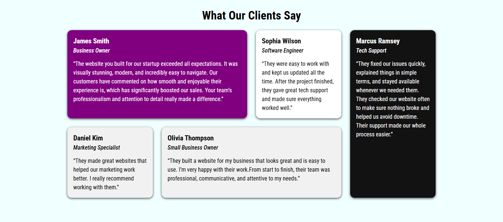

#  Testimonials Grid

A clean, modern, and fully responsive Testimonials Grid built with HTML and CSS. This project was good web development practice. It helped me work on layout, spacing, responsiveness, and clean design while improving my frontend skills.

---

##  Built With

- HTML
- CSS 

---

##  Features

- Fully responsive (mobile, tablet and computer).  
- Clean, modern card design.
- CSS Grid layout with flexible column/row spans.  
- Google Fonts (Roboto Condensed).
- Smooth hover effects that make cards pop. 
- Easy to extend, restyle, or integrate into future projects. 

---

##  Preview

---

##  What I Worked On

- Improved my understanding of responsive, mobile-first layouts. 
- Practiced using CSS Grid for multi-column and multi-row structures.  
- Clean card design with good spacing, fonts, and shadows.  
- Added small interaction hover effects for better user experience.  